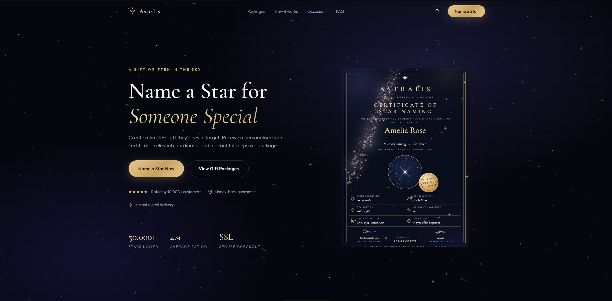
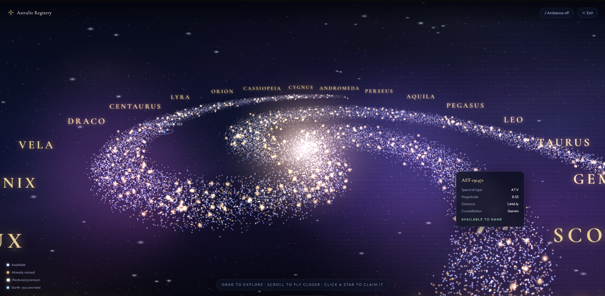
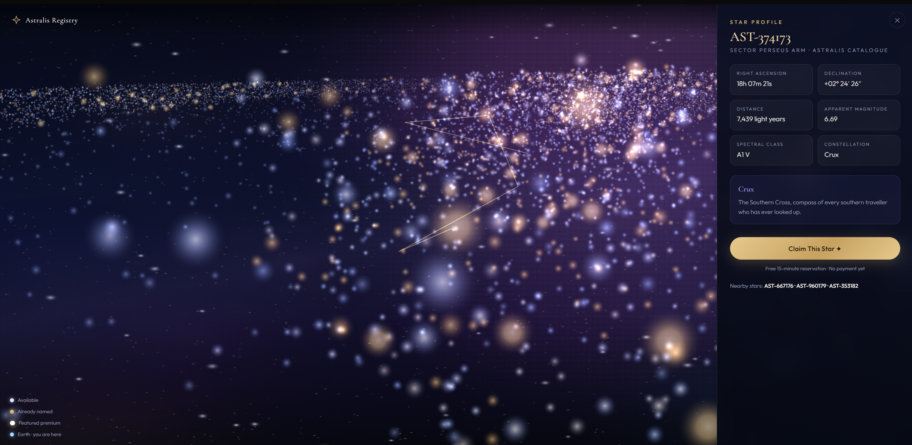
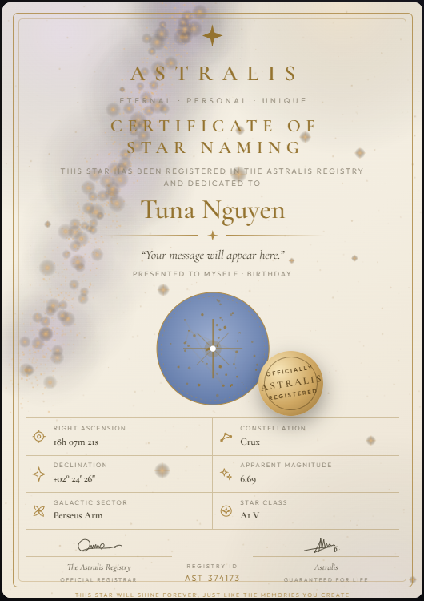
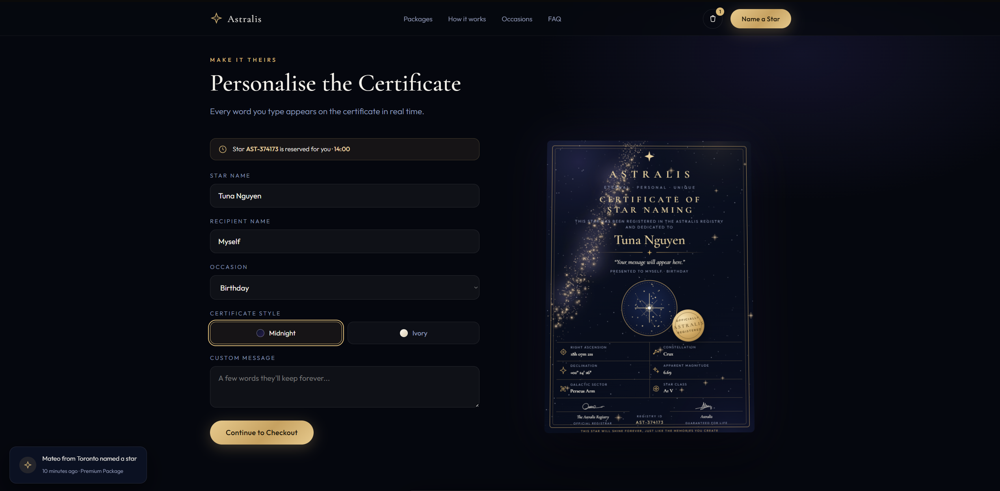

# Astralis - Interactive 3D Star Naming E-Commerce Experience

A production-deployed luxury e-commerce site where customers explore a procedurally generated 3D galaxy, personally discover and claim a star, and receive a personalised certificate, all rendered in real time in the browser.

**Live demo:** https://astralisregistry.com · **Stack:** Three.js (WebGL), Vanilla JavaScript, Next.js 14 (deployment shell), Vercel Edge

---

## Overview

Star naming gifts are typically sold through static product pages: pick a package, type a name, check out. Astralis reframes the purchase as an experience. Instead of selecting a product from a catalogue, the customer flies through an interactive spiral galaxy of 38,000+ stars, inspects real astronomical properties (spectral class, magnitude, distance, constellation), and claims a star they discovered themselves.

The business problem this solves is conversion psychology for emotional, high-margin gift products: ownership feeling drives purchase intent far more than feature lists. The engineering problem is delivering an AAA-feeling 3D experience inside a single page that loads fast, runs at 60 FPS on mid-range phones, and degrades gracefully.

The entire customer-facing experience is intentionally built as one dependency-free HTML file (+2000 lines, 50+ functions) using vanilla JavaScript and Three.js, wrapped in a minimal Next.js shell that provides production hosting, HTTPS hardening and a growth path for server-side features.

## Features

- **Procedural 3D galaxy explorer**: 38,000-star spiral galaxy rendered as GPU point clouds, with warp-speed entry animation, drag/scroll/pinch/pan navigation with inertia, hover tooltips, cinematic camera travel to a selected star, and an animated constellation-drawing effect
- **Deterministic star catalogue**: every star's ID, coordinates, spectral type, magnitude, distance and availability are derived from a hash of its index, giving a consistent "database" of hundreds of thousands of records with zero storage and zero network requests
- **Scarcity modelling**: About 20% of stars are deterministically marked "Already Named" (gold) and a small fraction as featured premium stars, mirroring real inventory states
- **Live certificate engine**: a data-driven template renders three certificate instances (hero, live preview, showcase) with two finishes (Midnight / Ivory), exact A4 proportions (1:1.414), procedurally painted galaxy backgrounds, SVG signatures and a registry data grid that updates in real time as the customer types
- **Full purchase funnel**: package tiers, personalisation form, reservation timer, multi-step checkout UI with payment provider buttons (simulated, ready for Stripe integration), cart state and order confirmation
- **Content sub-pages**: FAQ, About, Contact (with validated form), Terms, Privacy and Refund policy rendered through a lightweight client-side page router
- **Conversion layer**: animated counters, countdown timer, recent-purchase notifications, social proof and trust messaging
- **Generated ambience**: an optional ambient soundtrack synthesised live with the Web Audio API (oscillators + LFOs), no audio files shipped
- **Accessibility**: `prefers-reduced-motion` support throughout, ARIA roles and states, keyboard escape chains, visible focus styles

## Technology Stack

| Layer | Technology | Why |
|---|---|---|
| 3D rendering | Three.js r128 (WebGL) | Point-cloud rendering of tens of thousands of stars at 60 FPS; loaded from CDN to keep the core file self-contained |
| UI / interactivity | Vanilla JavaScript (ES2020) | Zero framework overhead for a single-page experience; total JS payload is a fraction of a typical React bundle |
| Styling | Hand-written CSS with custom properties, container queries, glassmorphism | Design tokens enable theme switching (certificate finishes) with no duplicated styles; `cqw` units make the certificate resolution-independent |
| Typography | Cormorant Garamond + Outfit (Google Fonts) with system-serif fallbacks | Luxury serif/sans pairing that degrades gracefully offline |
| App shell | Next.js 14 (App Router) | Production headers, redirects and middleware on Vercel, plus a clear migration path to server-side checkout APIs |
| Hosting / TLS | Vercel Edge | Automatic Let's Encrypt SSL provisioning and renewal, TLS 1.2/1.3, global CDN |
| Audio | Web Audio API | Procedural ambience with zero asset weight |

## Architecture

```
┌─────────────────────────────  Browser  ─────────────────────────────┐
│                                                                     │
│  public/index.html (single-file application)                       │
│  ├── Landing experience                                            │
│  │     ├── 2D canvas starfield (pre-rendered diffraction sprites)  │
│  │     ├── Scroll reveal + counter system (IntersectionObserver)   │
│  │     └── Certificate renderer (template + canvas texture)        │
│  ├── Galaxy explorer (Three.js)                                    │
│  │     ├── Warp scene (line-segment streaks)                       │
│  │     ├── Galaxy scene: 3 point clouds by availability state,     │
│  │     │   detail layer, background shell, core/nebula sprites,    │
│  │     │   constellation labels, Earth marker                      │
│  │     ├── Custom orbit controls (inertia, pinch, raycasting)      │
│  │     └── Camera tween system (select → travel → orbit)           │
│  ├── State (cart, reservation, theme) + checkout flow              │
│  └── Client-side router for content/legal sub-pages                │
│                                                                     │
└─────────────────────────────────────────────────────────────────────┘
                                   │
                          Vercel Edge Network
                                   │
        middleware.js (HTTPS + canonical host enforcement)
        next.config.mjs (HSTS, security headers, www→apex, rewrites)
```

There is intentionally no database or backend in the current build. Star data is computed, not stored (see below), and checkout is a complete front-end flow awaiting a payment-provider integration.

## System Design Decisions

**Computed catalogue over a database.** Each star's full record is derived on demand from a deterministic hash (`h1(index, salt)`) of its index, seeded into trigonometric noise. This gives consistent results across sessions, supports an effectively unlimited catalogue, removes all storage and API latency, and made the scarcity system (20% reserved) a one-line predicate. The trade-off (no cross-user persistence) is acceptable pre-launch and isolates the future backend to a thin "claims" table.

**Single-file core, framework shell.** Keeping the experience in one HTML file forces discipline (no dead dependencies), makes the artifact trivially portable and reviewable, and means first paint depends on exactly two external requests (Three.js, fonts). The Next.js wrapper exists purely for production concerns: security headers, redirects, edge middleware and a future API surface.

**Point clouds over meshes.** Stars are `THREE.Points` with additive-blended canvas-generated sprite textures, split into three geometry groups by availability state so each state gets its own material (colour, size) while raycasting can ignore unselectable groups. 38,000 stars render in a handful of draw calls.

**Procedural textures everywhere.** Star sprites, nebula clouds, the deep-space backdrop, constellation labels and the certificates' galaxy backgrounds are all painted onto `<canvas>` at runtime and uploaded as textures or data URLs. The site ships zero image assets.

**Resolution-independent certificates.** The certificate is a CSS container (`container-type: inline-size`) with every measurement in `cqw` units at a fixed 1:1.414 (A4) aspect ratio, so the same markup is pixel-correct as a 300px phone preview or a print-scale render.

## Installation

```bash
git clone https://github.com/<your-username>/astralis.git
cd astralis
npm install
npm run dev        # http://localhost:3000
```

The core experience can also be run with no tooling at all by opening `public/index.html` directly in a browser.

## Configuration

No environment variables are required for the static experience. Production domain behaviour (canonical host, HSTS) is configured in `next.config.mjs` and `middleware.js`; change `CANONICAL_HOST` there if deploying under a different domain.

## Usage

1. `npm run dev` and open the site.
2. Click **Name a Star Now** to enter the galaxy explorer (warp animation, then free navigation).
3. Hover stars to inspect them; click an available star to travel to it and open its profile.
4. **Claim This Star** reserves it for 15 minutes, returns to the personalisation section and pre-fills the certificate with live coordinates.
5. Choose Midnight or Ivory finish, complete the multi-step checkout (simulated payment), and receive an order confirmation.

## Project Structure

```
astralis/
├── public/
│   └── index.html        # Complete application (~1,900 lines): markup, styles, all systems
├── app/
│   ├── layout.js         # Minimal Next.js shell (metadata)
│   └── page.js           # Fallback route (root is rewritten to index.html)
├── middleware.js         # Edge: HTTPS enforcement, canonical host, secure-cookie pattern
├── next.config.mjs       # HSTS + security headers, www→apex redirect, root rewrite
├── package.json
└── README.md
```

## Technical Challenges & Solutions

**Raycasting points at every zoom level.** A fixed raycast threshold either missed stars from far away or selected ten at once up close. Solved by scaling `raycaster.params.Points.threshold` with camera distance each frame, and distinguishing clicks from drags with a pointer-travel test so orbiting never triggers selection.

**Additive blending washout.** Thousands of additive sprites turned the galaxy core into a white sheet when zoomed in. Solved with zoom-adaptive curves: opacity floors at 62% while point size shrinks up to 65% as the camera approaches, and the core glow fades independently, keeping individual stars legible at close range.

**Square seams on nebula textures.** Radial gradients drawn near canvas edges clipped into visible rectangles in the scene. Solved by compositing a radial alpha mask with `globalCompositeOperation = 'destination-in'` so every texture fades to transparent before reaching its bitmap edge.

**OrbitControls unavailable.** The CDN build of Three.js r128 ships without example controls, so navigation is a custom spherical-coordinate controller: damped inertia on rotation, wheel/pinch dolly with exponential scaling, clamped polar angles, and a tween system that interpolates both camera target and radius for the star-selection travel sequence.

**A4 certificate layout at any size.** Fitting a 20-element document (heading stack, star map, six-cell data grid, signatures) into an exact 1:1.414 frame across screen sizes was solved with container-query units for every measurement and a space-between flex column, then verified by budgeting the vertical sum in `cqw` before styling.

**In-app browser quirks.** Anchor navigation and overlays misbehaved inside TikTok/Instagram webviews. Solved by replacing native anchor jumps with a guarded `scrollIntoView` handler, `scroll-margin-top` offsets for the fixed nav, and explicit escape/close chains for stacked overlays.

## Performance Optimizations

- Star field rendered in ~6 draw calls via grouped `BufferGeometry` point clouds; per-star data is computed lazily on hover, never stored
- `renderer.setPixelRatio` capped at 2 to avoid 3x-DPI fill-rate cost on phones
- All sprite/nebula/backdrop textures generated once and reused; the certificate galaxy texture is painted a single time and shared by all three certificates as a data-URL background
- `depthWrite: false` on all transparent point materials to skip depth-sort artefacts and writes
- Scroll effects driven by `IntersectionObserver` (no scroll-thread work); observers disconnect after firing
- Animation loop suspended entirely while the explorer is closed; warp scene and galaxy scene never render in the same frame
- `prefers-reduced-motion` short-circuits the heaviest animation paths

## Security Considerations

- **HSTS** (`max-age=63072000; includeSubDomains; preload`) plus `X-Content-Type-Options`, `X-Frame-Options`, `Referrer-Policy` and `Permissions-Policy` on every response via `next.config.mjs`
- **Transport**: automatic Let's Encrypt certificates, TLS 1.2/1.3 only, HTTP→HTTPS and www→apex permanent redirects enforced at the edge and again in middleware
- **Cookies**: documented `httpOnly` / `secure` / `sameSite` pattern in middleware, ready for session work; the current static build sets none
- `X-Powered-By` disabled; no third-party scripts beyond Three.js and fonts; no user data is transmitted or stored in the current build
- Honest-marketing safeguards are treated as a trust feature: the UI and legal pages state plainly that naming is symbolic and not IAU-recognised

## Future Improvements

- Stripe Checkout integration with webhook-confirmed orders and a persisted claims table (PostgreSQL/Prisma), replacing the simulated payment step
- Server-generated PDF certificates from the same template data
- Public registry lookup endpoint keyed by certificate ID
- WebGL post-processing bloom pass and instanced star glints
- Shared star "co-ownership" gifting links and email delivery scheduling
- Playwright end-to-end tests for the claim → personalise → checkout funnel

## Screenshots

> _Placeholders, replace with captures:_
>
> | Landing hero | Galaxy explorer | Star profile |
> |---|---|---|
> |  |  |  |
>
> | Certificate (Midnight) | Certificate (Ivory) | Checkout |
> |---|---|---|
> |  |  |  |

## Deployment

Deployed on **Vercel** with the domain **astralis.com.au**. Pushing to `main` triggers an automatic build and edge deployment; SSL issuance and renewal are fully automated. DNS uses an apex A record (`76.76.21.21`) and a `www` CNAME to `cname.vercel-dns.com`, with `www` permanently redirected to the apex. Verification: `curl -I http://astralis.com.au` returns a permanent HTTPS redirect, and response headers include the full security set above.

## Author

Tuna Nguyen (Anh Tuan Nguyen)
Bachelor of Information Technology, Monash University

[LinkedIn](www.linkedin.com/in/anh-tuna-nguyen) · [GitHub](https://github.com/Lem0n-bot) · [Astralis Registry](https://astralisregistry.com)

---

*Astralis star naming is symbolic and not affiliated with the International Astronomical Union.*